# Digit Recognition App

This project showcases the development and deployment of a **Digit Recognition App** using a **Convolutional Neural Network (CNN)** trained on the **MNIST dataset**. The application integrates an interactive web interface for digit recognition, a backend API for prediction services, and is fully containerized and deployed on **AWS ECS**. 

The system allows users to draw digits on a web canvas, and the model predicts the digit based on the drawing in real-time. It leverages **Docker** for containerization, **FastAPI** for the backend API, and **Streamlit** for the frontend. The entire system is deployed in the cloud using **AWS ECS Fargate** to ensure scalability and reliability.

---

## Table of Contents

1. [Project Overview](#project-overview)
2. [Features](#features)
3. [Model Training](#model-training)
4. [Frontend: Streamlit Application](#frontend-streamlit-application)
5. [Backend: FastAPI for Predictions](#backend-fastapi-for-predictions)
6. [Connecting the Frontend and Backend](#connecting-the-frontend-and-backend)
7. [Containerization with Docker](#containerization-with-docker)
8. [Pushing Docker Image to Docker Hub](#pushing-docker-image-to-docker-hub)
9. [Deploying the Application on AWS ECS](#deploying-the-application-on-aws-ecs)
10. [Deployment Results](#deployment-results)
11. [Next Steps](#next-steps)

---

## Project Overview

The **Digit Recognition App** allows users to easily recognize handwritten digits (0–9) through a trained **Convolutional Neural Network (CNN)**. The application includes:

- **Model Training**: A PyTorch-based CNN trained on the **MNIST dataset**, with GPU acceleration using Google Colab and tracked using **[Weights & Biases (W&B)](https://wandb.ai/)** for experiment tracking and visualization.
- **Interactive Web UI**: Built with **Streamlit** to enable users to draw a digit on a canvas, which is then sent to the backend for prediction.
- **REST API**: Developed with **FastAPI** to provide a prediction endpoint, allowing the frontend to send requests and receive predictions.
- **Cloud Deployment**: The application is fully containerized using **Docker** and deployed on **AWS ECS** using the **Fargate launch type** for easy scaling and management.

---

## Features

- **Trainable Model**: Allows for easy training of the CNN model on the MNIST dataset using **PyTorch** and **GPU acceleration**.
- **Logging and Visualization**: Training and testing metrics are logged using **Weights & Biases (W&B)** for analysis and model tracking.
- **Frontend and Backend**:
  - **Frontend**: **Streamlit** provides an intuitive user interface where users can draw digits, and predictions are displayed instantly.
  - **Backend**: **FastAPI** serves as the backend API to handle the digit recognition requests and provides predictions via HTTP endpoints.
- **Scalable Deployment**: The application is containerized with **Docker** and deployed to **AWS ECS**, providing a scalable, cloud-based solution.

---

This setup makes it easy for users to access the app through a web interface or interact with the backend API for digit recognition, providing both an interactive experience and a robust, production-ready API.

---

## Model Training

The training script is implemented in PyTorch with the following key features:

### Model Architecture

The **LargerCNN** model is a three-layer convolutional neural network with the following architecture:
1. **Convolutional Layers**:
   - 1st Layer: 64 filters.
   - 2nd Layer: 128 filters.
   - 3rd Layer: 256 filters.
2. **Pooling**: MaxPooling layers to reduce spatial dimensions.
3. **Fully Connected Layers**:
   - Layer 1: 512 neurons.
   - Layer 2: 256 neurons.
   - Layer 3: Output of 10 neurons (digits 0–9).
4. **Dropout**: Applied to prevent overfitting.

### Training Environment

The model is trained on Google Colab with a **T4 GPU** for acceleration. The process includes:
- **Dataset**: [MNIST](http://yann.lecun.com/exdb/mnist/) for handwritten digit recognition.
- **Optimizer**: Adam with a learning rate of 0.001.
- **Loss Function**: Cross-entropy loss for multi-class classification.
- **Logging**: All metrics and model checkpoints are logged to W&B.

### Results

- **Training Loss vs. Epoch Graph**:
  
  Below is a visualization of the training loss across epochs, showing consistent convergence:

  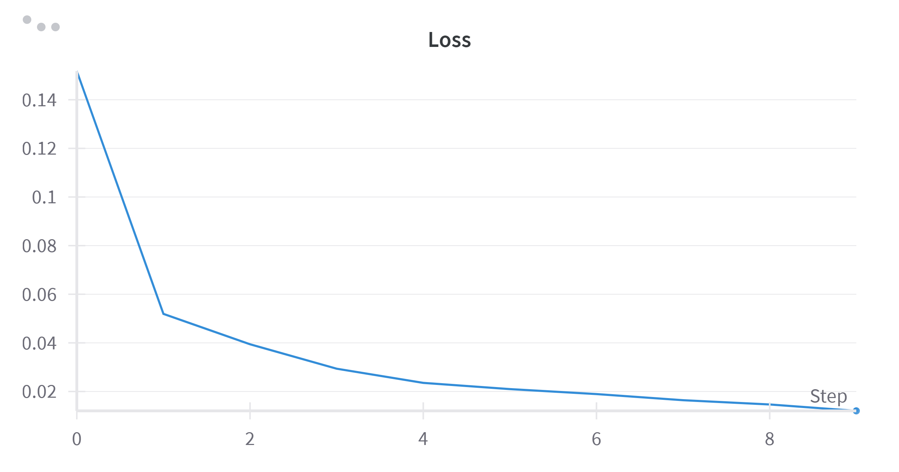
- **Test Accuracy**: Achieved a high test accuracy of **99.28%** on the MNIST dataset.


### Steps to Train the Model

1. **Setup the Environment**:
   - Open `train_model.py` in Google Colab.
   - Ensure that the GPU runtime is enabled (`Runtime > Change Runtime Type > GPU`).

2. **Install Dependencies**:
   ```bash
   pip install torch torchvision matplotlib wandb
   ```

3. **Run the Training Script**:
   ```bash
   python train_model.py
   ```

4. **Save the Model**:
   The trained model weights will be saved as `mnist_larger_cnn.pth` inside the root directory.

5. **Visualize Results**:
   The script includes a visualization function to display predictions on test images.

--- 

## Frontend: Streamlit Application

The **frontend** for the digit recognition application allows users to draw a digit on a canvas and get predictions. The application is implemented using **Streamlit**, making it interactive and easy to use.

### Key Features

- **Interactive Canvas**: Users can draw a digit using a drawable canvas widget.
- **Real-time Predictions**: The drawn digit is sent to a backend API for inference, and the prediction is displayed immediately.

### Frontend Code (`app.py`)

The frontend is implemented in `app.py` using Streamlit and the `streamlit-drawable-canvas` library. The user interface includes:
- A canvas for drawing digits.
- Communication with a backend FastAPI server for predictions.

### How to Run the Frontend

1. Install the required dependencies:
   ```bash
   pip install streamlit streamlit-drawable-canvas requests pillow numpy
   ```

2. Start the frontend application:
   ```bash
   streamlit run app.py
   ```

3. Access the app in your browser at `http://localhost:8501`.

---

## Backend: FastAPI for Predictions

The **backend** is implemented using **FastAPI** and is responsible for serving predictions from the trained CNN model. It processes the uploaded images, preprocesses them, and performs inference using the PyTorch model.

### Key Features

- **Model Loading**: Loads the trained `LargerCNN` model for inference.
- **Image Preprocessing**: Converts uploaded images to grayscale, resizes them to 28x28 pixels, and normalizes them for model input.
- **Error Handling**: Detects blank images and returns an appropriate error message.

### Backend Code (`backendapi.py`)

The backend is implemented in `backendapi.py` and includes:
- A root endpoint (`/`) for health checks.
- A prediction endpoint (`/predict/`) that accepts an image file, processes it, and returns the predicted digit.

### How to Run the Backend

1. Install the required dependencies:
   ```bash
   pip install fastapi uvicorn torch torchvision pillow numpy
   ```

2. Start the backend server:
   ```bash
   uvicorn backendapi:app --host 0.0.0.0 --port 8000
   ```

3. The API will be accessible at `http://127.0.0.1:8000`. Use the `/predict/` endpoint to send images for predictions.

---

## Connecting the Frontend and Backend

To connect the **frontend** with the **backend**:
1. Ensure the backend is running on `http://127.0.0.1:8000`.
2. Update the `app.py` file's `requests.post()` URL if needed:
   ```python
   response = requests.post("http://127.0.0.1:8000/predict/", files={"file": buffer})
   ```

When both services are running, users can draw digits in the Streamlit app, which sends the image to the FastAPI backend for prediction.

---

## Containerization with Docker

To simplify deployment and ensure consistency across environments, the application (both frontend and backend) is containerized using **Docker**. This allows running the entire application in isolated environments.

### Dockerfile

The `Dockerfile` specifies the instructions to build the Docker image for the application:

```dockerfile
# Step 1: Use the official Python runtime as the base image
FROM python:3.9-slim

# Step 2: Set the working directory inside the container
WORKDIR /app

# Step 3: Copy the requirements.txt file first and install dependencies
COPY requirements.txt .
RUN pip install --no-cache-dir -r requirements.txt

# Step 4: Copy the entire app directory into the container (the contents of ./app)
COPY ./app /app

# Step 5: Expose necessary ports
EXPOSE 8000 8501

# Step 6: Command to run both FastAPI and Streamlit concurrently
CMD ["sh", "-c", "uvicorn backendapi:app --host 0.0.0.0 --port 8000 & streamlit run /app/app.py --server.port=8501 --server.address=0.0.0.0"]
```

### Explanation of Steps in the Dockerfile

1. **Base Image**: Use the official Python 3.9-slim image to keep the container lightweight.
2. **Working Directory**: Set `/app` as the working directory inside the container.
3. **Install Dependencies**: Copy the `requirements.txt` file and install Python dependencies using `pip`.
4. **Copy Application Code**: Copy the entire `app` directory (including `app.py` and `backendapi.py`) into the container.
5. **Expose Ports**: Open ports `8000` for FastAPI and `8501` for Streamlit.
6. **Run Commands**: Use a shell command (`sh -c`) to run both FastAPI and Streamlit services concurrently.

### Building the Docker Image

1. Save the `Dockerfile` in your project directory.
2. Run the following command to build the Docker image:
   ```bash
   docker build -t digit-recognition-app .
   ```

### Running the Docker Container

After building the image, start a container using:
```bash
docker run -p 8000:8000 -p 8501:8501 digit-recognition-app
```

- The **backend API** will be accessible at `http://127.0.0.1:8000`.
- The **frontend Streamlit app** will be accessible at `http://127.0.0.1:8501`.

### Verify the Application

1. Open the Streamlit app at `http://127.0.0.1:8501`.
2. Draw a digit on the canvas, and the frontend will send the image to the backend for prediction.
3. View the predicted digit displayed in the app.

## Pushing Docker Image to Docker Hub

After containerizing the application, the next step is to make the Docker image available online. This allows for easy deployment to cloud services like AWS ECS or Kubernetes. In this project, the Docker Hub repository `aiinabox/digit-recognition-app-rep` is used for hosting the Docker image.

### Steps to Push the Image to Docker Hub

1. **Tag the Docker Image**:  
   Add a tag to the locally built Docker image to link it to your Docker Hub repository. Replace `aiinabox/digit-recognition-app-rep` with your Docker Hub repository name:
   ```bash
   docker tag digit-recognition-app aiinabox/digit-recognition-app-rep:1.0
   ```

2. **Log In to Docker Hub**:  
   Authenticate with Docker Hub using the `docker login` command:
   ```bash
   docker login
   ```
   - Enter your Docker Hub **username** and **password** when prompted.

3. **Push the Image to Docker Hub**:  
   Push the tagged image to your Docker Hub repository:
   ```bash
   docker push aiinabox/digit-recognition-app-rep:1.0
   ```

4. **Verify the Image on Docker Hub**:  
   After the push completes:
   - Visit your Docker Hub repository: [Docker Hub - aiinabox/digit-recognition-app-rep](https://hub.docker.com/repository/docker/aiinabox/digit-recognition-app-rep).
   - Confirm that the image appears with the `l.0` tag.

---

### Using the Docker Image

Once the image is hosted on Docker Hub, it can be used for deployment on various platforms, such as:

- **Local Machines**:  
  Pull and run the Docker image locally using:
  ```bash
  docker run -p 8000:8000 -p 8501:8501 aiinabox/digit-recognition-app-rep:1.0
  ```

- **Cloud Services (e.g., AWS ECS)**:  
  Use the Docker Hub image URL `aiinabox/digit-recognition-app-rep:1.0` for cloud-based deployments.

## Deploying the Application on AWS ECS

To make the digit recognition application accessible on the cloud, AWS ECS (Elastic Container Service) is used. The deployment uses the **Fargate** launch type, which is a serverless compute engine for containers.

### Steps to Deploy on AWS ECS

#### A. Create an ECS Cluster

1. Go to the [AWS ECS Console](https://console.aws.amazon.com/ecs/).
2. Click on **Create Cluster**.
3. Choose **Fargate** as the cluster type.
4. Provide a name for your cluster (e.g., `digit-recognition-cluster`).
5. Complete the setup to create the cluster.

#### B. Create a Task Definition

1. Navigate to **Task Definitions** in the ECS Console.
2. Click **Create new Task Definition**.
3. Choose **Fargate** as the launch type.
4. Configure the task definition with the following settings:
   - **Container Name**: `digit-recognition-app`.
   - **Image**: Specify the Docker Hub image URL:  
     `aiinabox/digit-recognition-app-rep:1.0`.  
   - **Port Mappings**:  
     - **8000**: for FastAPI backend.  
     - **8501**: for Streamlit frontend.
   - **CPU and Memory**: Allocate resources as per your application’s requirements, e.g., `0.5 vCPU` and `1GB memory`.
5. Save the task definition.

#### C. Deploy the Task

1. Go to your ECS cluster in the console.
2. Click on **Create Service**.
3. Choose **Fargate** as the launch type.
4. Select the task definition created in the previous step.
5. Specify the desired number of tasks (typically 1 for small-scale apps).
6. Review the configuration and click **Launch Service** to deploy.

---

### Accessing Your Application

1. After ECS deploys the service, go to the cluster page in the ECS Console.
2. Look for the **public IP** or **DNS** assigned to your service.
3. Use the following URLs to access your application:
   - **Streamlit Frontend**: `http://<public-ip>:8501`
   - **FastAPI Backend**: `http://<public-ip>:8000`

---

## Deployment Results

After deploying the application on AWS ECS, everything was set up successfully. Below are the results:

### 1. **ECS Cluster Dashboard**
Upon visiting the AWS ECS cluster, I confirmed that the service was up and running. Here’s a screenshot of the ECS Cluster dashboard with the deployed service and task details:

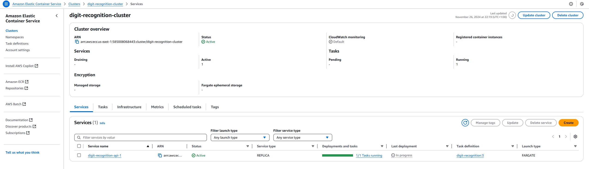

### 2. **Service Running on AWS Fargate**
The service deployed successfully with a public IP, and I was able to access the frontend and backend APIs through the respective ports:

- **Frontend (Streamlit)**:  
   Access the digit recognition UI via the Streamlit app. It was successfully served on port `8501`.

   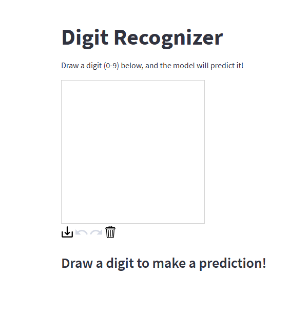  
   *(This image shows the user interface of the frontend where users can draw a digit.)*

- **Backend (FastAPI)**:  
   The backend API is running on port `8000`, where it serves as the endpoint for handling predictions. If you visit `http://<public-ip>:8000`, you will see the following message indicating the API is live:

    ```json
    {
      "message": "Welcome to the Digit Recognition API"
    }
    ```

    This is a simple response from the FastAPI server, confirming that the API is running. The actual predictions are made when you send an image to the `/predict/` endpoint through the Streamlit frontend.

### 3. **Application in Action**
Here’s a step-by-step breakdown of how the application works:

- The user draws a digit (0-9) on the **Streamlit Canvas**.
- The image is sent to the **FastAPI Backend** via an HTTP POST request.
- The backend predicts the digit and sends back the result.
- The **Streamlit UI** displays the predicted digit in real-time.

   Here’s a screenshot of the **Streamlit app** in action where users draw a digit, and the model predicts it. The images below show the predicted digits from 0 to 9.

   | **Digit 0** | **Digit 1** | **Digit 2** | **Digit 3** | **Digit 4** |
   |:-----------:|:-----------:|:-----------:|:-----------:|:-----------:|
   | 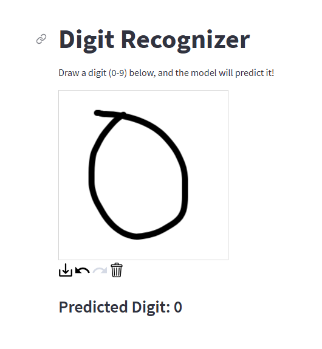 | 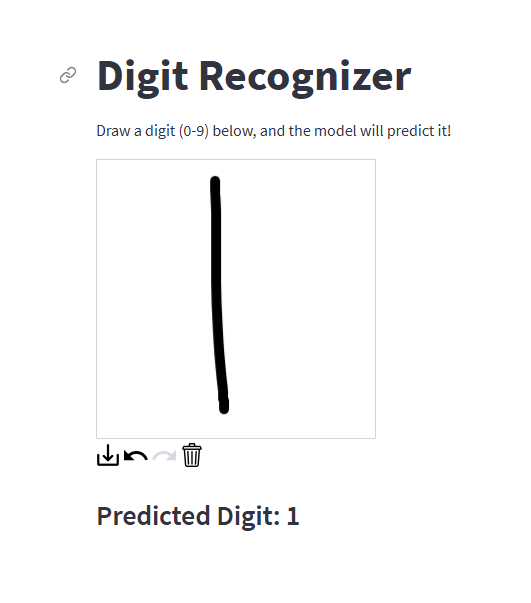 | 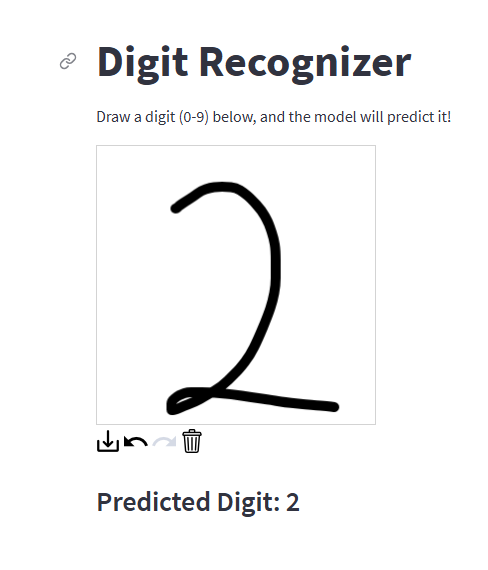 | 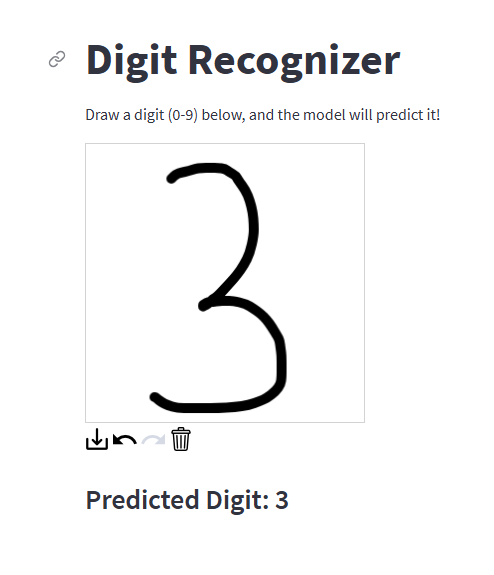 | 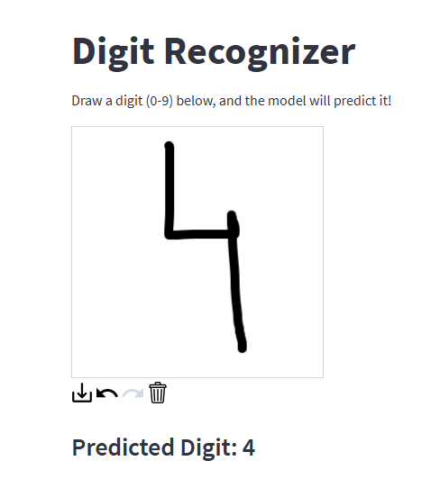 |

   | **Digit 5** | **Digit 6** | **Digit 7** | **Digit 8** | **Digit 9** |
   |:-----------:|:-----------:|:-----------:|:-----------:|:-----------:|
   | 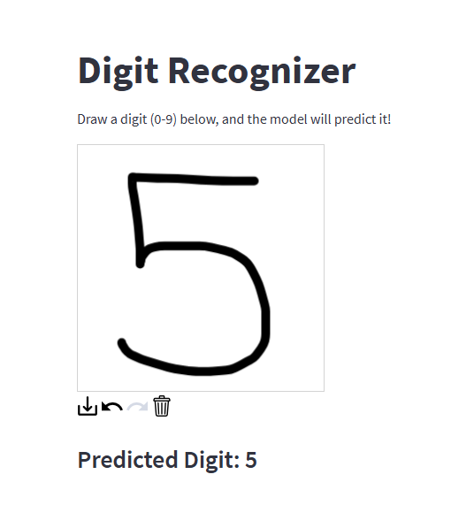 | 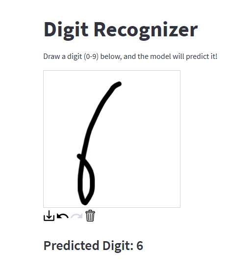 | 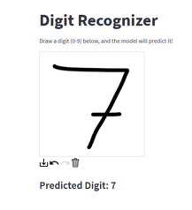 | 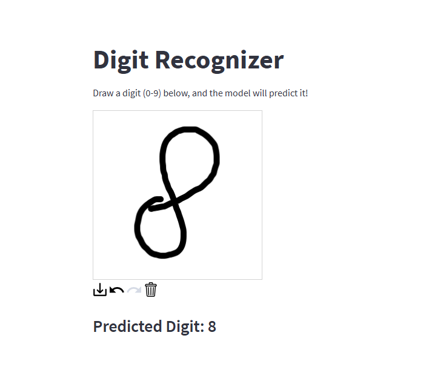 | 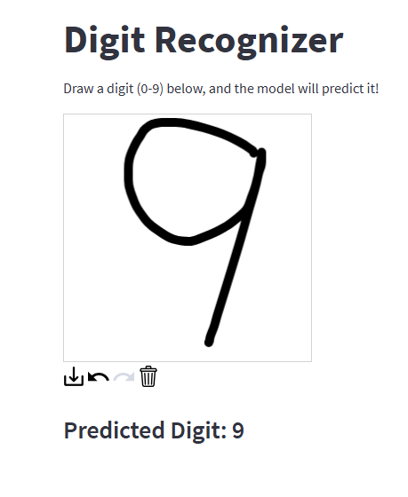 |


---

### Next Steps

Now that the application is deployed and running smoothly, here are some improvements and enhancements I plan to explore in the future:

1. **Add Authentication**: Implement a simple authentication system to secure both the API and frontend, ensuring only authorized users can access and interact with the app.
2. **Container Orchestration**: Explore container orchestration tools like Kubernetes to manage and scale the application, ensuring high availability and efficient load balancing.
3. **Monitor Application Performance**: Set up monitoring and logging services on AWS ECS to track key performance metrics, including latency, resource utilization, and error rates, for better operational insights.
4. **Continuous Deployment**: Automate the deployment process by integrating the project with a CI/CD pipeline (e.g., GitHub Actions), enabling seamless updates and faster iterations.

---


